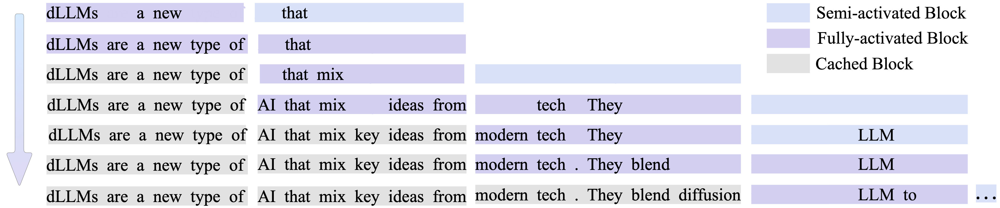
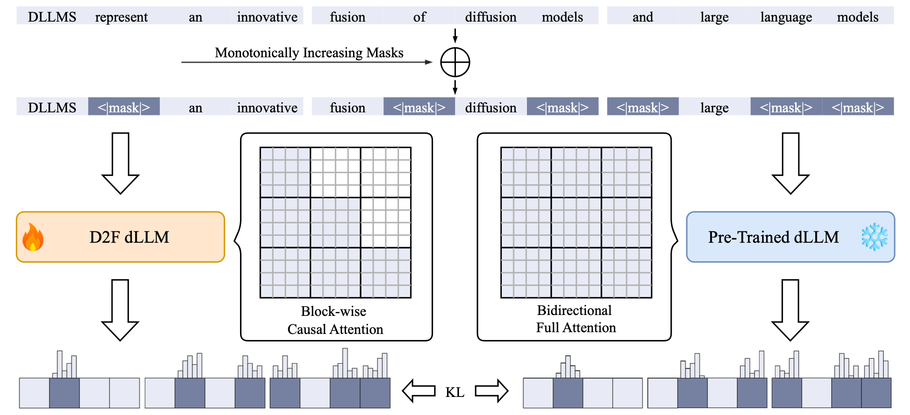
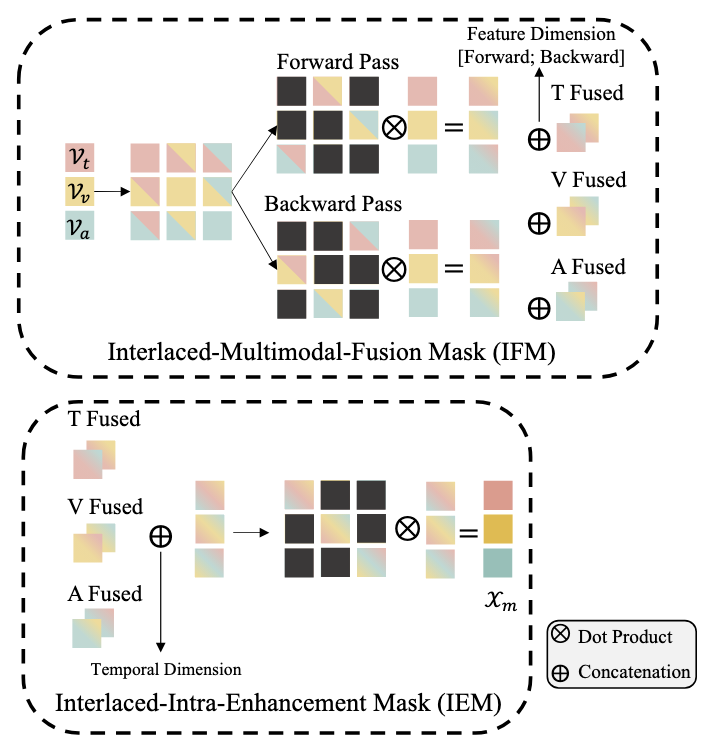








> Nothing Special...

Hello there! My name is **Yijie Jin**. I am currently an incoming Ph.D. student at Qingyuan Research Institute, School of Computer Science, Shanghai Jiaotong Univerisity (SJTU). Also, I am now an Undergrad. student at the Department of Computer Science and Technology, School of Computer Engineering and Science, Shanghai University (SHU).

My English name is **Drew**. In English-speaking contexts, I prefer to use Drew as my first name, so my full name can be Drew Yijie Jin (Drew Y. JIN). Feel free to address me by any of these names—whether it’s Yijie, Drew, or Jin—I'm happy to respond to any of them!

I am passionate about advancing **Machine Learning Systems (MLSys)**, with a strong focus on **Efficient Generative AI**. Additionally, I used to explore **traditional NLP** and **multimodal learning**, particularly in the domain of **Multimodal Sentiment Analysis (MSA)**. 

Recently,

- I am working on D2fEngine with all my efforts recently, which is the first open-sourced vLLM for dLLMs worldwide.

  - **Lang**: Triton, CPP (keeps on learning, diving in), Golang in backend development, Vue in frontend development.
  - **MLSys/Efficient LLMs**: dLLM inference optimization, parallel decoding, efficient reasoning, kv cache compression, etc.

- Planning to learn: Ray, TileLang, practice my leetcode ablitiy, etc.

- Projects planning to work on: minitorch.

# 🧑‍🏫 Advisors

- **Ph.D. Advisor**: Prof. [Zhijie Deng](https://thudzj.github.io/).

- **B.Eng. Supervisor**: Prof. [Junjie Peng](https://scholar.google.com/citations?hl=en&user=l7IPf0sAAAAJ&view_op=list_works&sortby=pubdate).

# 🤔 Skills

- **Lang**: Skillful Python; Naive C/CPP/CUDA; Learning Golang, JS/TS

- **Frameworks**: Skillful PyTorch; Naive LibTorch, JAX + Haiku, Triton; Learning Gin + Gorm, Vue

- **Tools**: All toolchains in Visual Studio Code; vscode-clangd-CMake-toolchain, Git, Linux, MacOS (UNIX), Docker, SLURM.

# 🤓 Blogs

All my blogs are posted on **Zhihu**. Feel free to follow me: [Drew](https://www.zhihu.com/people/drew-44-8).

> I regularly update my blog with a variety of content, including experience sharing, technical coding tutorials, academic paper discussions, personal career insights, and casual life reflections—all written in a relaxed and conversational style.

I'm also maintaining the [MLSys Wiki](https://www.notion.so/1466c8eb3813801baed2e5e09c7f7bb5?v=2166c8eb38138009b1cb000c06c1477e&source=copy_link) for self-learning and sharing technical insights.

# 🔥 News

- *2025.09*: &nbsp;🎉🎉 Drew was luckily admitted as a Ph.D. candidate at Qingyuan Research Institute, School of Computer Science, Shanghai Jiao Tong University, and officially entered [DENG Lab @ SJTU](https://zhijie-group.github.io/).

- *2025.08*: &nbsp;🎉🎉 Drew was invited to have a talk on D2fEngine on vLLM Shenzhen Meetup. 

- *2025.05*: &nbsp;🎉🎉 GsiT accepted by ACL 2025 (main). 

- _2025.05_: &nbsp;🎉🎉 Our team (SHU Optimus) make it NO.7 Worldwide in the Final Round of ASC 2025 Student Supercomputer Challenge (ASC25).

- _2025.03_: &nbsp;🎉🎉 Our team (SHU Optimus) win the **First Prize** (NO.5 Worldwide) in the Preliminary Round of ASC 2025 Student Supercomputer Challenge (ASC25).

# 📝 Publications

ArXiv

[Diffusion LLMs Can Do Faster-Than-AR Inference via Discrete Diffusion Forcing](https://arxiv.org/abs/2505.01068)

Xu Wang, Chenkai Xu, **Yijie Jin**, Jiachun Jin, Hao Zhang, Zhijie Deng

[**Project**](https://github.com/zhijie-group/Discrete-Diffusion-Forcing) <strong></strong>
- 50x Faster than LLaDA
- 2x Faster than AR models
- D2fEngine (vLLM for dLLMs)

ACL 2025 (Main)

[Multimodal Transformers are Hierarchical Modal-wise Heterogeneous Graphs](https://aclanthology.org/2025.acl-long.109/)

**Yijie Jin**, Junjie Peng, Xuanchao Lin, Haochen Yuan, Lan Wang, Cangzhi Zheng

[**Project**](https://github.com/drewjin/GsiT) <strong></strong>

- **Efficiency and Effectiveness**: 1/3 number of parameters without additional computational overhead compared with traditional MulTs.
- Modal-wise Block-Sparse Attention and All-Modal-In-One Fusion.

<!-- - [Lorem ipsum dolor sit amet, consectetur adipiscing elit. Vivamus ornare aliquet ipsum, ac tempus justo dapibus sit amet](https://github.com), A, B, C, **CVPR 2020** -->

# 🎖 Honors and Awards

- _2025.03_ **First Prize** of 2025 Asia Supercomputer Community Student Supercomputer Challenge (ASC25, NO.5 Worldwide Preliminary Round, NO.7 Worldwide Final Round).

- _2024.11_ **Second Prize** of Shanghai Area in The 2024 China Undergraduate Mathematical Contest in Modeling (CUMCM 2024).

- _2024.11_ Shanghai University Academic Excellence **First-class** Scholarship.

- _2024.08_ **First Prize** of The 14th Asia and Pacific Mathematical Contest in Modeling (APMCM 2024).

- _2023.11_ Shanghai University Academic Excellence **Top-class** Scholarship (Rank 15 in 1500).

# 📖 Educations

- incoming, Ph.D. Student, Shanghai Jiao Tong University.

- _2022.09 - (now)_, Undergrad., Shanghai University.

- _2019.09 - 2022.07_, Senior High., Chengdu NO.12 High School (The Affiliated High School of Sichuan University).

- _2016.09 - 2019.07_, Junior High., Chengdu NO.7 High School (Chengdu High School).

- _2010.09 - 2016.07_, Primary School, Chengdu Paotongshu Primary School.

# 💬 Invited Talks

<!-- - *2021.06*, Lorem ipsum dolor sit amet, consectetur adipiscing elit. Vivamus ornare aliquet ipsum, ac tempus justo dapibus sit amet.
- *2021.03*, Lorem ipsum dolor sit amet, consectetur adipiscing elit. Vivamus ornare aliquet ipsum, ac tempus justo dapibus sit amet.  \| [\[video\]](https://github.com/) -->

- *2025.08*, vLLM Shenzhen Meetup, Drew gave a talk on D2fEngine (the first vLLM implementation for dLLMs in open-source community).

# 💻 Internships

- _2025.03 - 2025.09_, Research Intern, DENG Lab @ SJTU, Shanghai Jiao Tong University, Shanghai, China.

- _2024.10 - 2024.12_, Research Intern, NLP Group, Hongkong University of Science and Technology Guangzhou (HKUST-gz), Guangzhou, China.

- _2023.11 - (now)_, Research Assistant, LITS, Shanghai University, Shanghai, China.

  
Click to Explore More About Me

  
  <h1>⚽️ Hobbies</h1>
  
  <h2>Sports</h2>
  <ul>
    <li><strong>Soccer</strong>: Paris Saint-Germain (PSG), Neymar Jr.</li>
    <li><strong>Basketball</strong>: Golden State Warriors (GSW), Stephen Curry.</li>
  </ul>
  
  <h2>Music</h2>
  

    Honestly speaking, I love music, especially American music. <em>Listen to albums instead of singles</em>.
  

  <ul>
    <li><strong>Pop</strong>: Taylor Swift, Ed Sheeran, Justin Bieber, etc.</li>
    <li><strong>Hip-Hop</strong>: Kanye West (Ye), Eminem, etc.</li>
    <li><strong>Rock</strong>: Coldplay, etc.</li>
    <li><strong>R&B</strong>: Usher, The Weeknd, Ariana Grande, etc.</li>
    <li><strong>Folk</strong>: Leonard Cohen, Bon Iver, etc.</li>
    <li><strong>Country</strong>: Alison Krauss, Alan Jackson, etc.</li>
    <li><strong>Electronic</strong>: The Chainsmokers, Martin Garrix, Marshmello, etc.</li>
    <li><strong>CN Pop</strong>: Jay Chou, David Tao, Weibird, etc.</li>
  </ul>
  
  <h2>Movies</h2>
  <ul>
    <li><strong>Science Fiction</strong>: Star Wars, Star Trek, Wandering Earth, Interstellar, Inception, The Matrix, etc.</li>
    <li><strong>Super Hero</strong>: All DC (Zack Snyder Directed), All Marvel (End Game and earlier pieces), Batman Series (Christopher Nolan Directed), Watchmen, etc.</li>
    <li><strong>Others</strong>: all of the classic movies.</li>
  </ul>
  
  <h2>Books</h2>
  <ul>
    <li><strong>Science Fiction</strong>: The Three-Body Problem Trilogy, Foundation Series, Robot Series, Dune, Hyperion Cantos, etc.</li>
    <li><strong>Fantasy</strong>: A Song of Ice and Fire, Harry Potter, The Chronicles of Narnia, etc.</li>
    <li><strong>Chinese Fantasy</strong>: Battle Through the Heavens, Dragon Raja, Shanghai Fortress (the novel, not the movie), etc.</li>
    <li><strong>Others</strong>: The Century Trilogy, and most of the classic books.</li>
  </ul>

  <h1>🧑‍🤝‍🧑 Friends of Mine</h1>

  
<a href="https://blog.errant.top/">Jiayang Li</a>

  
<a href="https://isaacghx.github.io/about/">Haoxiang Zhang</a>

